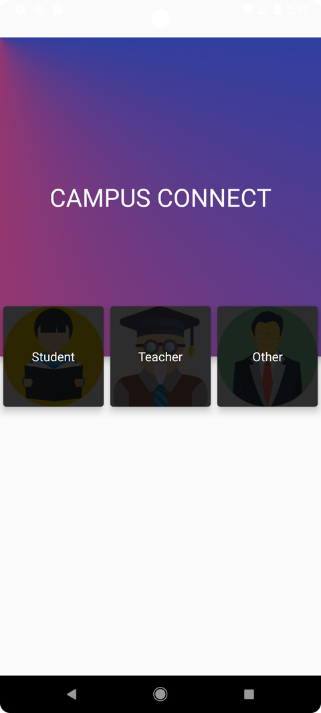
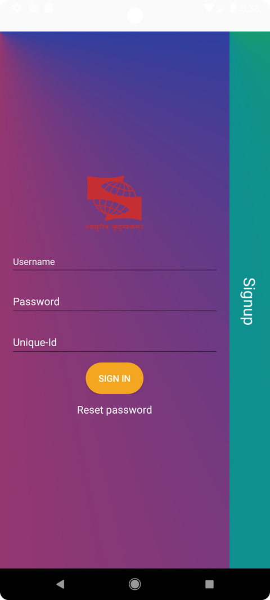
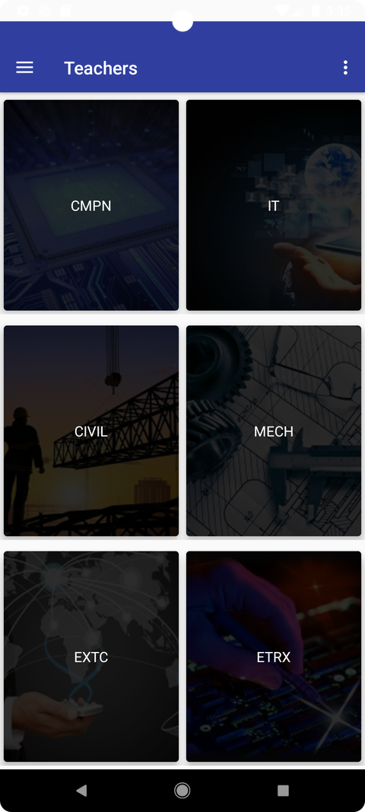

# Campus Connect

Campus Connect is a native Android application built for an engineering college in 2019, connecting **students**, **teachers**, and **non-teaching staff** around day-to-day academic activities — notices, syllabus tracking, attendance, and branch-wise file sharing. It's backed by a PHP + MySQL REST-style API.


<p align="center">
  
  
  
</p>

## Features

**Student**
- Registration and login (username + GR number + password)
- Branch and year setup on first login
- View college notices and branch-wise uploaded files
- View and check off subject-wise syllabus chapters
- View personal attendance percentage

**Teacher**
- Login (username + Teacher ID + password)
- Post notices and upload academic files, per branch
- Mark daily attendance by roll number
- View class attendance records
- Update syllabus completion status

**Non-teaching staff**
- Login and registration (username + Staff ID + password)
- View and upload general college files/notices

**Supported branches:** Computer Engineering (CMPN), Information Technology (IT), Electronics & Telecommunication (EXTC), Electronics (ETRX), Mechanical (MECH), Civil (CIVIL).

## Tech stack

| Layer | Technology |
|---|---|
| Client | Android (Java), Android Support Library 27.1.1, min SDK 21 / target & compile SDK 27 |
| Build system | Gradle 5.6.4, Android Gradle Plugin 3.6.4 |
| Networking | [android-networking](https://github.com/amitshekhariitbhu/Fast-Android-Networking) 1.0.1 (bundled `.aar`) |
| Image loading | Glide 3.7.0 |
| Dialogs | Material Dialogs 0.9.6.0 |
| File picker / date-time picker | materialfilepicker 1.9.1, sublimepickerlibrary 2.1.1 (bundled `.aar` files) |
| Backend | PHP (procedural, `mysqli`) |
| Database | MySQL / MariaDB |
| Web server | Apache (via XAMPP/WAMP/MAMP, or any PHP-capable server) |

## Project structure

```
Campus Connect/
├── app/                        # Android client
│   └── src/main/
│       ├── java/com/campusconnect/sit/
│       │   ├── ui/             # Activities, fragments, adapters
│       │   ├── data/           # Network calls and models
│       │   ├── misc/           # Constants, helpers, custom widgets
│       │   └── base/           # Base Activity/Fragment/Adapter classes
│       ├── res/                # Layouts, drawables, strings, themes
│       └── AndroidManifest.xml
├── backend/
│   └── campusconnect/
│       ├── config.php          # Database connection settings
│       ├── schema.sql          # Full database schema + demo seed data
│       ├── login.php, register.php, ...     # Student endpoints
│       ├── otherlogin.php, otherregister.php # Teacher endpoints
│       ├── nontlogin.php, nontregister.php   # Non-teaching staff endpoints
│       ├── *upload.php                       # Per-branch file upload endpoints
│       ├── syllabus/                         # Syllabus load/save endpoints
│       ├── attendance/                       # Attendance insert/view endpoints
│       └── uploads/                          # Uploaded files land here at runtime
├── docs/screenshots/           # Screenshots used in this README
├── build.gradle, settings.gradle, gradle.properties
└── gradlew, gradlew.bat, gradle/wrapper/
```

## Requirements

- **Android Studio** (a recent version can still open and run this project — it targets a low enough API level to remain compatible)
- **JDK 8** (the project is configured for Java 8 source/target compatibility)
- **Android SDK Platform 27** and the corresponding build tools, installed via the Android Studio SDK Manager
- An **Android emulator** (API 21–27 recommended) or a physical Android device
- **PHP 7.x or 8.x** with the `mysqli` extension
- **MySQL or MariaDB**
- **Apache** (or PHP's built-in server, for quick local testing)

The easiest way to get PHP + MySQL + Apache together is an all-in-one stack like **XAMPP** (Windows/macOS/Linux), **MAMP** (macOS), or **WAMP** (Windows).

## Backend setup

### 1. Install a PHP + MySQL environment

Install XAMPP (or MAMP/WAMP), then start **Apache** and **MySQL** from its control panel.

### 2. Copy the backend into your web root

Copy the entire `backend/campusconnect/` folder into your server's web root, keeping the folder name `campusconnect`:

| Platform | Destination |
|---|---|
| XAMPP (Windows) | `C:\xampp\htdocs\campusconnect\` |
| XAMPP (macOS) | `/Applications/XAMPP/xamppfiles/htdocs/campusconnect/` |
| XAMPP/WAMP (Linux) | `/opt/lampp/htdocs/campusconnect/` |

### 3. Create the database

Open phpMyAdmin (`http://localhost/phpmyadmin`) and import `backend/campusconnect/schema.sql`, or from a terminal:

```bash
mysql -u root -p < backend/campusconnect/schema.sql
```

This creates the `campusconnect` database with all required tables (`students`, `teachers`, `nonteaching`, `subjects`, `syllabus`, `files`, `attendance`) and seeds it with a handful of demo accounts and sample data so the app has something to show immediately.

### 4. Check the database credentials

`backend/campusconnect/config.php` defaults to XAMPP's standard local settings:

```php
$DB_HOST = "localhost";
$DB_USER = "root";
$DB_PASS = "";
$DB_NAME = "campusconnect";
```

Update these only if your local MySQL setup uses a different user, password, or host.

### 5. Make the uploads folder writable

The PHP process needs write access to `backend/campusconnect/uploads/` to save files sent from the app's upload screens. This is already permissive on most local dev setups; on Linux/macOS you can confirm with:

```bash
chmod -R 755 backend/campusconnect/uploads
```

### 6. Verify the backend is running

Visit `http://localhost/campusconnect/config.php` in a browser. An empty JSON response (rather than a PHP error) confirms Apache, PHP, and the MySQL connection are all working.

## Android app setup

### 1. Open the project

Open the `Campus Connect/` folder (the one containing `build.gradle` and `settings.gradle`) in Android Studio and let it sync. Gradle will download version 5.6.4 automatically via the Gradle wrapper.

### 2. Point the app at your backend

The backend URL is defined in one place:
`app/src/main/java/com/campusconnect/sit/misc/utils/Constants.java`

```java
public static final String BASE_URL = "http://10.0.2.2/campusconnect";
```

- **Android Emulator:** leave this as `10.0.2.2` — that special address always routes to your host machine's `localhost`, so it works out of the box against a backend running on your development computer.
- **Physical device:** replace `10.0.2.2` with your computer's LAN IP address (e.g. `http://192.168.1.42/campusconnect`), and make sure the device and computer are on the same Wi-Fi network.

### 3. Run the app

Select a run configuration targeting an emulator (API 21–27) or a connected device, and click **Run**. The app installs and launches on the role-selection screen shown above.

## Demo accounts

The seed data in `schema.sql` includes one account per role so you can log in immediately without registering:

| Role | Username | ID | Password |
|---|---|---|---|
| Student | `rohan.mehta` | GR No. `CMPN1901042` | `campus1234` |
| Student | `ayesha.khan` | GR No. `IT1901017` | `campus1234` |
| Teacher | `anjali.deshmukh` | Teacher ID `FAC0231` | `campus1234` |
| Non-teaching staff | `suresh.pawar` | Staff ID `NT0119` | `campus1234` |

You can also register new accounts directly from the app; the backend hashes passwords with PHP's `password_hash()` and assigns a new GR number / Teacher ID / Staff ID automatically.

## Testing the application

With the backend running and the database seeded, exercise the full stack this way:

1. **Login** — Sign in with any demo account above from the corresponding role tab (Student / Teacher / Other).
2. **Registration** — From the login screen, use "Signup" to create a new account; confirm it can then log in.
3. **Forgot password** — Reset a demo account's password using its username + ID, then log in with the new password.
4. **Syllabus** — As a student, open a subject's syllabus and check off a chapter; as a teacher, confirm the same chapter shows as updated.
5. **Attendance** — As a teacher, mark attendance for a few roll numbers; as a student, confirm the attendance percentage reflects it.
6. **File uploads** — As a teacher or staff member, upload a file from a branch or the general tab; confirm it appears in the corresponding student-facing file list.

You can also test the backend independently of the Android app with `curl`, for example:

```bash
curl -X POST http://localhost/campusconnect/login.php \
  -d "username=rohan.mehta" -d "grno=CMPN1901042" -d "password=campus1234"
```

A healthy response looks like:

```json
{"error":false,"user":{"username":"rohan.mehta","fullname":"Rohan Mehta","grno":"CMPN1901042","branch":"cmpn","year":"third_year"}}
```

## Developer

Created by **Anil Bhati**, 25/09/2019.
